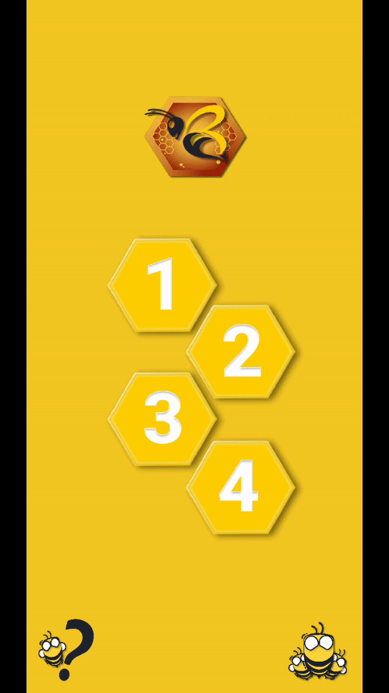

# BFast

Fun project: BFast (Be fast), is a fun interactive reaction game time.

## Packages, Technologies used
The game has 4 unique modes and beautiful caracters. The game is game using:
* [Flame-engine](https://pub.dev/packages/flame): to run the game.
* [Adobe Illustator](https://www.adobe.com/mena_en/products/illustrator/free-trial-download.html) and [Figma](https://www.figma.com/): for visuals.

## Game modes and features: 
* Get ready screen.
* Score screen.
* Lost screen.
* How to play screen.
* Highscore with persistante data.
* And more.

### Mode1: 
* In this mode the user have to **WAIT** for the message **CLICK**, When that happens user have to click. Their **SCORE** (in milliseconds) will be shown then.

### Mode2:
* In this mode, after user taps the start button, **WASP**s appear on the screen, user have to kill(tap) them before they disapear. **WASP**s Appear Randomly on the SCREEN.
* User gets **+1 score** for every HIT (before timer runs out). User gets **-1 life** point for MISS. After **3 misses** **LOST** screen is presented.

### Mode3: *IN DEVELOPEMENT.*
### Mode4: *COMMING SOON.*

## Game Demo:
 

# Team
* Developers: 
    * [M'hamed Lehbab](https://github.com/GitGud31)
* Design and Visuals: 
    * [M'hamed Lehbab](https://github.com/GitGud31)
    * [Ros.Arts](https://www.instagram.com/ros.arts__/)

# Road map:
* Finish Mode 3.
* Finish Mode 4.
* Add Buttons on-hit effect.
* Add sound.
* More models (bees and wasps).